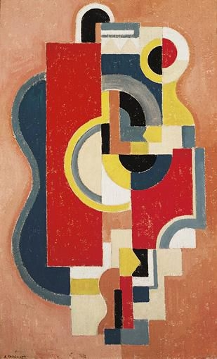
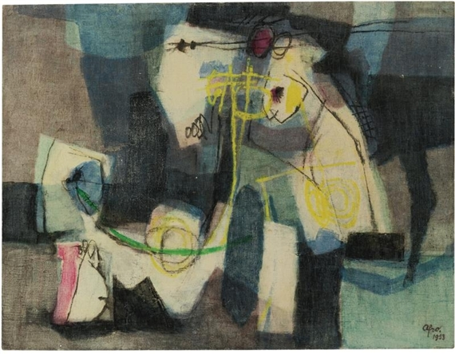
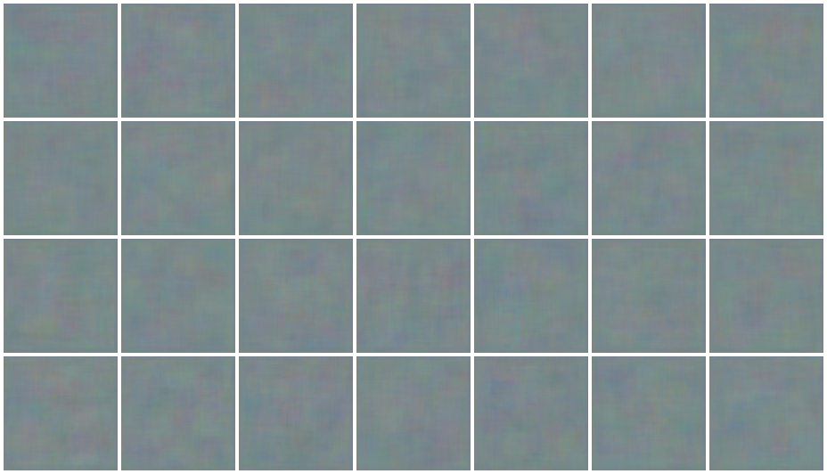
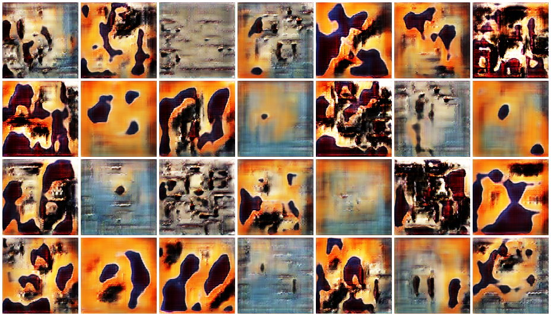

# Modern Art

A GAN trained over the Cubism images from wikiart dataset to recreate some kind of modern art images.

The Wikiart dataset can be downloaded [here](http://web.fsktm.um.edu.my/~cschan/source/ICIP2017/wikiart.zip) (Size = 25.4Gb).

Feel free to choose any one of the art genre. :grimacing:

# Model

The network is based on the DCGAN model.

A generative adversarial network (GAN) is a class of machine learning frameworks designed by Ian Goodfellow and his colleagues in 2014. Two neural networks contest with each other in a game (in the sense of game theory, often but not always in the form of a zero-sum game). Given a training set, this technique learns to generate new data with the same statistics as the training set.

Enough theory for today, if you're interested in further research about GANs, I recomment the following papers:

  - [Generative Adversarial Networks](https://arxiv.org/abs/1406.2661), By Ian Goodfellow (This guy is supercool)

  - [Deep Convolutional Generative Adversarial Networks](https://arxiv.org/abs/1511.06434)

# Input data

These are a few samples of the input images:

 

# Output

We feed in a random noise to the generator:

And after a few thousand iterations (10,000 epochs to be exact), we get the following output:

The output isn't really that great but that's because of the lack of finetuning and less epochs. I hope to increase the performance in the near future. 

The code is available in the [Modern Art](Modern%20Art.ipynb) notebook. Feel free to play around and modify the code.

I hope in the near future, the network will be able to generate images such as this one:

The network has been trained over NVIDIA GTX 1060 GPU with a memory of 6 Gigabytes. It took almost 3 hours to run 10,000 epochs and the save frequency was at 100 epochs. The images produced are of size 128 x 128 pixels. 

If you've read this till here, kudos to you because I almost fell asleep trying to document all this xD
